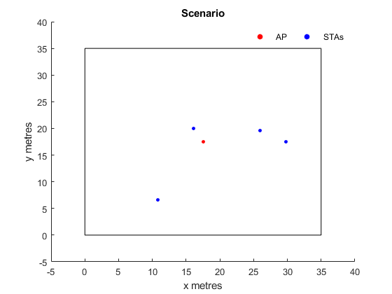
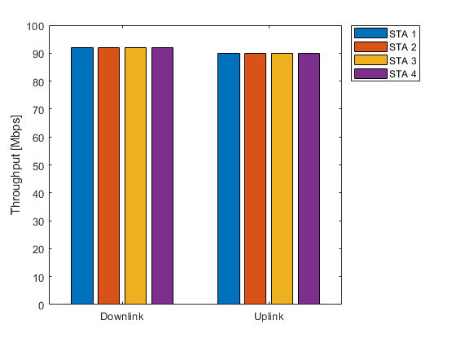
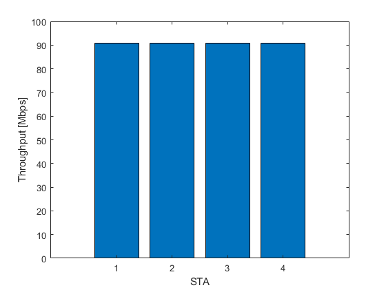
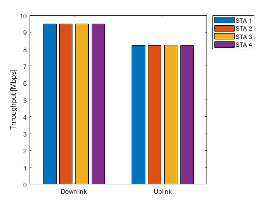
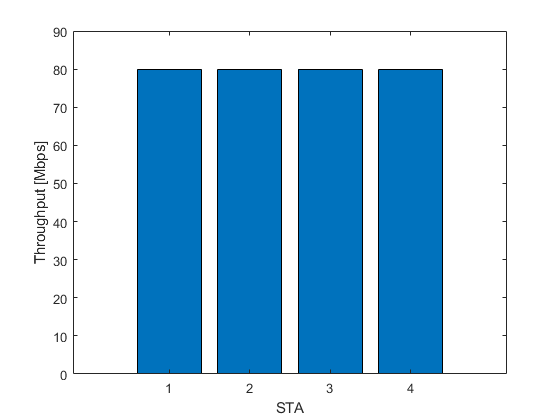

# NO Aggregation Frames

## Scenario

Distribution of STAs and AP in the room, measures values:

* X = 35 meters
* Y = 35 meters

## Results

### Optimization ON

Results obtained with the following parameters:

* nSTAs = 4
* NSS = 2

Downlink and Uplink Throughput Transmissions:

Integrated Downlink and Uplink Throughput Transmission:

### Optimization OFF

Results obtained with the following parameters:

* nSTAs = 4
* NSS = 2
* BW = 320 MHz

Downlink and Uplink Throughput Transmissions:

Integrated Downlink and Uplink Throughput Transmission:

## Developers

* [Alex Burgo](https://github.com/AlexBurgo)
